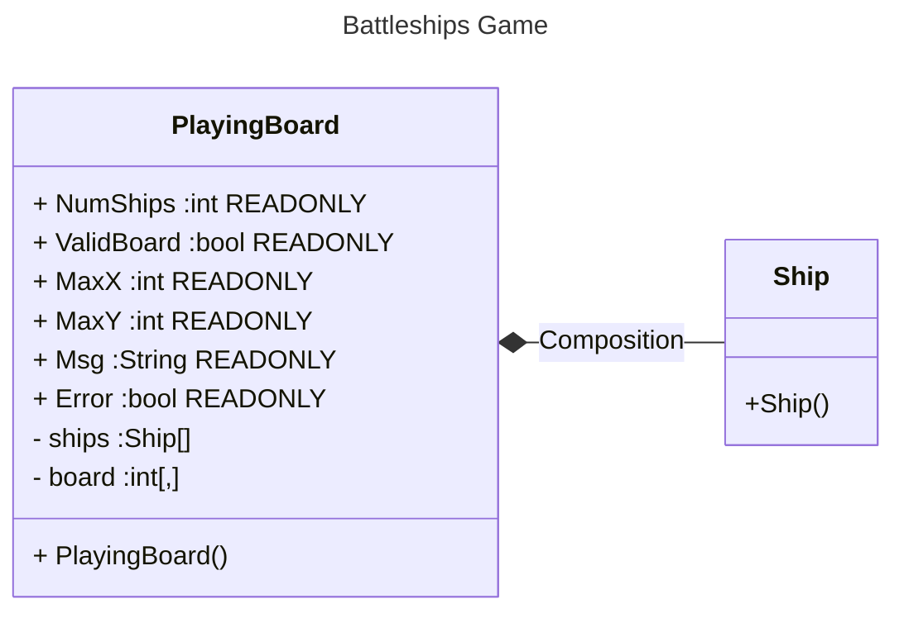

# Documentation of Classes

[Main Document](./README.md)

```mermaid

---
title: Battleships Game
---
classDiagram
direction RL

class Ship {
    +Ship()

}

class PlayingBoard {
    + NumShips :int READONLY
    + ValidBoard :bool READONLY
    + MaxX :int READONLY
    + MaxY :int READONLY
    + Msg :String READONLY
    + Error :bool READONLY
    - ships :Ship[] 
    - board :int[,] 
    + PlayingBoard()
}


Ship --* PlayingBoard : Composition 

```
